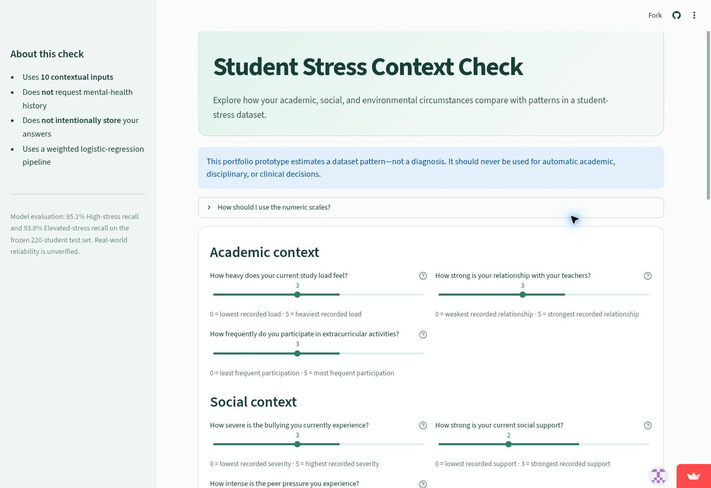
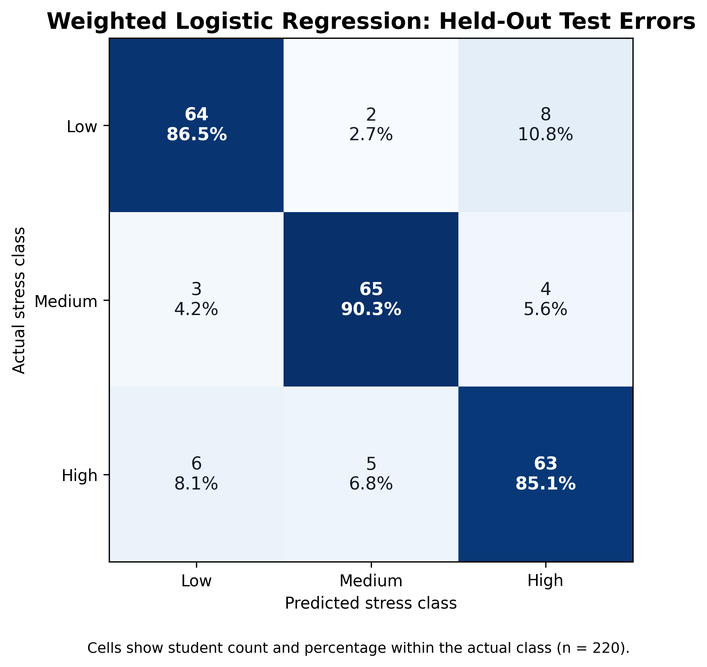

# Student Stress Context Check

[](https://academic-stress-research-kbbj67qwaukazpk2ycbbak.streamlit.app/)
[](https://www.python.org/)
[](https://scikit-learn.org/)

An educational machine-learning project that estimates whether a student's academic, social, and environmental circumstances resemble **Low**, **Medium**, or **High** stress patterns in the study dataset.

**[Try the live application](https://academic-stress-research-kbbj67qwaukazpk2ycbbak.streamlit.app/)**



## Why this project prioritizes recall

Missing a student with elevated stress is more concerning than unnecessarily suggesting a supportive check-in. Model selection therefore emphasized recall for the High-stress class while still monitoring precision, macro F1, and balanced accuracy.

## Final test results

The selected model is a weighted multinomial logistic-regression pipeline evaluated once on a frozen, stratified test set of 220 students.

| Metric | Result |
|---|---:|
| High-stress recall | 85.1% |
| High-stress precision | 84.0% |
| Elevated-stress recall (Medium or High) | 93.8% |
| Macro F1 | 87.3% |
| Balanced accuracy | 87.3% |

Six High-stress students were incorrectly classified as Low stress. This is the most consequential error pattern and remains an important limitation.



## Modeling approach

- Target: `stress_level` (`0 = Low`, `1 = Medium`, `2 = High`)
- Data split: stratified 80% training and 20% frozen testing
- Model comparison: repeated stratified cross-validation on training data only
- Selected model: logistic regression with `class_weight={0: 1, 1: 1, 2: 1.5}`
- Pipeline: most-frequent imputation, standardization, and classification
- Deployment artifact: pipeline refitted on all 1,100 records only after final evaluation

The deployed model uses ten contextual features:

`study_load`, `bullying`, `social_support`, `noise_level`, `peer_pressure`, `teacher_student_relationship`, `living_conditions`, `safety`, `basic_needs`, and `extracurricular_activities`.

It intentionally excludes mental-health history and direct psychological or physical symptoms from the application.

## Repository structure

```text
academic-stress-research/
├── app.py                         # Streamlit interface
├── data/                          # Local dataset instructions
├── figures/                       # Analysis and model figures
├── models/                        # Saved pipeline and metadata
├── notebooks/
│   ├── analysis.ipynb             # Data understanding and feature policy
│   └── modeling.ipynb             # Model preparation, comparison, and evaluation
├── src/prediction.py              # Input validation and prediction helpers
├── tests/test_prediction.py       # Prediction-pipeline tests
└── requirements.txt               # Application dependencies
```

## Run the application locally

```bash
git clone https://github.com/ShayanNajafian/academic-stress-research.git
cd academic-stress-research

python -m venv .venv
```

Activate the environment:

```bash
# Windows PowerShell
.venv\Scripts\Activate.ps1

# macOS or Linux
source .venv/bin/activate
```

Install dependencies and launch the app:

```bash
python -m pip install --upgrade pip
pip install -r requirements.txt
streamlit run app.py
```

## Reproduce the notebooks

Download `StressLevelDataset.csv` from the [Student Stress Factors dataset](https://www.kaggle.com/datasets/rxnach/student-stress-factors-a-comprehensive-analysis) and place it at:

```text
data/raw/StressLevelDataset.csv
```

Then install the notebook tools and run the notebooks in order:

```bash
pip install jupyterlab matplotlib pytest
jupyter lab
```

1. `notebooks/analysis.ipynb`
2. `notebooks/modeling.ipynb`

Run the prediction tests with:

```bash
pytest -q
```

## Responsible-use limitations

- This is a portfolio prototype, not a diagnostic or clinical tool.
- It must not be used for automatic academic, disciplinary, or healthcare decisions.
- The dataset contains unusually strong and clean feature–target relationships; real-world reliability is unverified.
- Numeric code meanings are incompletely documented, and the sample may not represent other student populations.
- Model probabilities describe patterns learned from this dataset, not a student's clinical probability of stress.
- The application does not intentionally store responses, but deployment-platform behavior should be reviewed before any real-world use.

The correct use is a voluntary self-check that may encourage an early, supportive conversation—not a final judgment about a student.

## Data reference

The project uses the public Student Stress Factors dataset. Related variable descriptions and research context are available in the [Frontiers in Psychology study](https://www.frontiersin.org/journals/psychology/articles/10.3389/fpsyg.2025.1684529/full).

